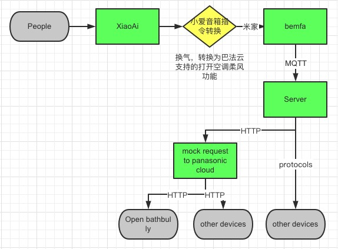
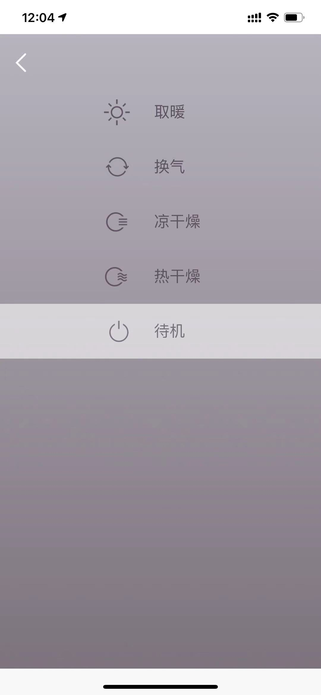
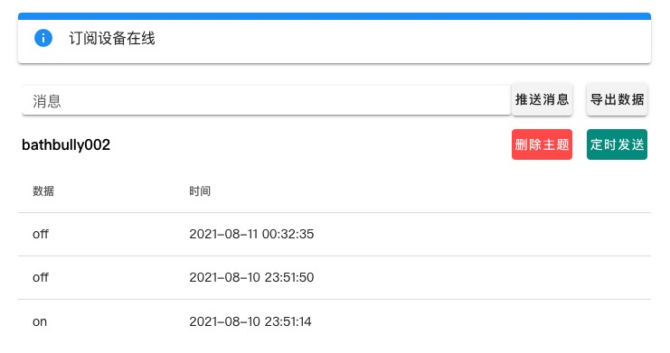
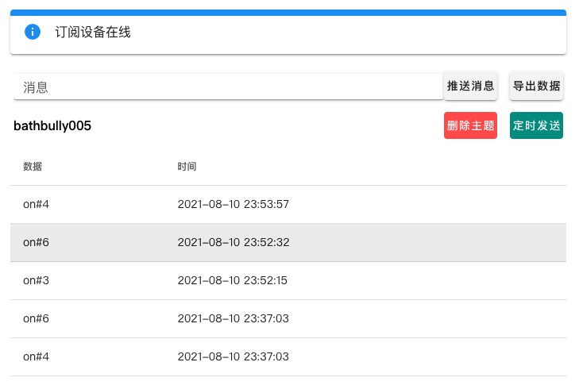
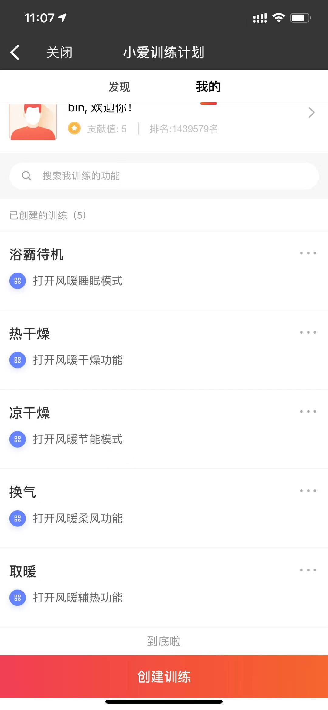

# A stupid way to extend miot/xiaoai.

### Demo for Panasonic Bath Heater `FV-RB20VL1`

1. 逆向 `Panasonic Smart China`，获得控制浴霸的请求信息（HTTP 请求），详见 `apps/panasonic.py`；
   
2. 通过米家 APP 添加 `巴法`，以支持第三方设备，实现监听巴法云的 MQTT
   消息，巴法云目前不支持浴霸，需要使用其他设备进行替代并映射，因灯与运行模式完全独立，建议实现两个设备，详见 `server.py`；
   
   
3. 为了更好的体验，需要在小爱音箱 APP 中，创建训练，转换浴霸指令为巴法云支持的指令。
   

### Installation:

`copy .env.example .env`

`python3 -m venv venv`

`source venv/bin/activate`

`pip install -r requirements.txt`

### Run server:

`python apps/server.py`

### Changelog

2024-06-29

    1. 重构代码，新增松下空调
    2. replace config.py with dotenv  
    3. 小爱训练计划中已支持第三方设备(巴法云)展示与命令映射，配置体验稍有提升
